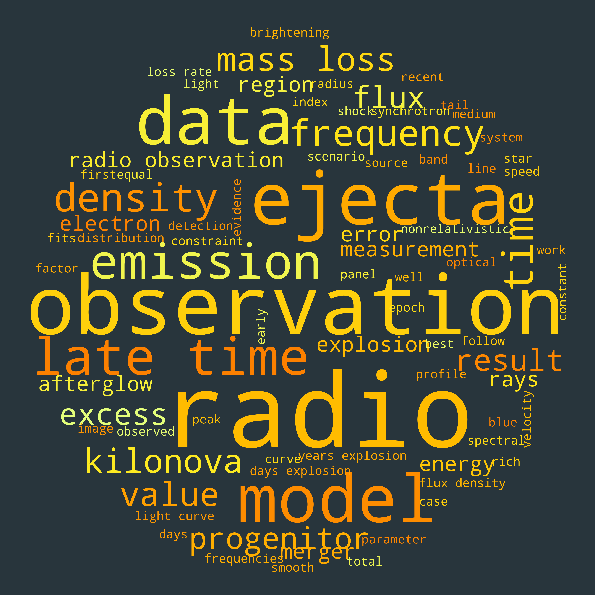

# Word cloud from your Publications

Generate word cloud from pdf of your publications. Use the shell script in this
repo [`paper_pdf_to_text.sh`](paper_pdf_to_text.sh) to convert all pdfs in
the directory `papers` to text.

## Dependencies 
Python packages
- numpy  
- [nltk](https://www.nltk.org/) : natural language toolkit to remove verbs, pronouns and nouns
- [wordcloud](https://github.com/amueller/word_cloud) : Package to generate wordclod from text
 
External packages
- pdftotext : extract text from pdf files of your publications. 

Work in progress (here are the things I need to finish) 
- Need to update set of stop words to remove unwanted words (Please let me know
  if you find sets of words that you want to remove)

Here is an sample word cloud generated from this code :

